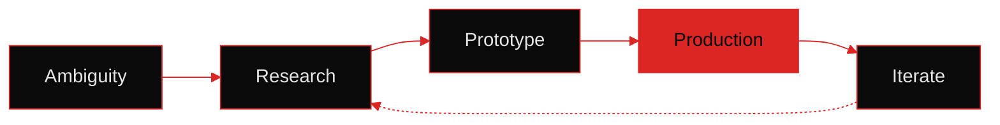
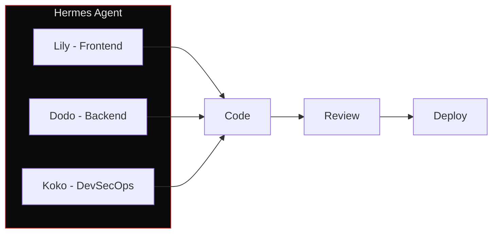

# Maulana Kayyis Purnadiva

> **Turning ambiguity into working systems.**  
> Fullstack · AI Infrastructure · Digital Problem Solver

---

### This is not just code.

I approach problems as an **end-to-end system builder** — not an engineer waiting for specs. Ambiguity is welcome. If the problem is unclear, I clarify it. If no system exists, I build from scratch. If one does, I make it more efficient.

**My loop:**


---

## What I've Built

### 🧠 AI Agent Infrastructure

Deployed LLM orchestration systems in production — Anthropic API, RAG pipelines, autonomous agent workflows (n8n). My **DeMek squad** (Lily/Dodo/Koko) works as an AI-powered dev team doing code review, planning, and deployment.



### 📊 Fullstack Applications

Next.js + React + Node.js — from a corruption monitoring dashboard to a banking platform. TypeScript end-to-end. Deployed on Vercel + AWS.

### 🏗️ System Architecture

REST/GraphQL APIs, PostgreSQL schema design, microservices in Laravel and NestJS. Production systems for Indonesian government ministries (Kemenag, Kemendag) running 24/7.

### ☁️ Infrastructure & DevOps

AWS EC2, Docker, Cloudflare Tunnel, Tailscale mesh, GitHub Actions CI/CD. All services self-hosted — cost-efficient, security-hardened.

> **Cost-kere principle:** microservice architecture on low-cost instances. No over-provisioning. Every dollar justifies itself.

---

## Stack

```
Frontend:   TypeScript · React · Next.js · Tailwind CSS · Framer Motion
Backend:    Node.js · NestJS · Express · Laravel · REST · GraphQL
AI/LLM:     Claude API · RAG · n8n · Prompt Engineering · Agent Workflows
Cloud:      AWS · Docker · Vercel · Cloudflare · Oracle Cloud
Databases:  PostgreSQL · SQLite · MySQL · Supabase
Tools:      Git · CI/CD (GitHub Actions) · Postman · Figma
```

---

## Why I'm Different

1. **AI-driven is not a buzzword** — I deploy LLM agents in production, not just ChatGPT sessions. My agent infrastructure includes autonomous code review, deployment orchestration, and self-improving workflows.

2. **Broke but scalable** — cost-efficient architecture on free-tier friendly instances. Microservice-ready without the enterprise tax.

3. **Problem-first, tech-second** — I choose the stack that fits the problem. If a spreadsheet solves it, I use a spreadsheet.

4. **Security-by-default** — all credentials in Bitwarden. Zero hardcoding. UFW, iptables, Cloudflare Tunnel — minimum attack surface.

---

## Projects worth a look

| Project | What It Does |
|---------|-------------|
| [hermes-infra](https://github.com/lanss-id/hermes-infra) | Infrastructure-as-code for a multi-service AI agent system (Hermes + 9Router + OpenWA), single-instance deployment behind Cloudflare Tunnel |
| [koruptor-watchlist-ui](https://github.com/lanss-id/koruptor-watchlist-ui) | Dark-mode monitoring dashboard for corruption cases — Next.js, ApexCharts, Taste-Silk UI |
| [banking-app](https://github.com/lanss-id/banking-app) | Full-stack banking platform — account management, transfers, real-time tracking (TypeScript end-to-end) |
| Trading Bot | Automated signal + execution system using Claude API + RAG pipeline, self-hosted on Oracle Cloud & AWS |

---

## Reach me

- GitHub: [lanss-id](https://github.com/lanss-id)
- Email: maulanakayyis354@gmail.com  
- LinkedIn: [lanss.id](https://linkedin.com/in/lanss-id)

```diff
+ Currently open to remote fullstack / AI infrastructure roles
+ PST-overlap availability
```

---

*If you read this far: I'm looking for interesting problems. Got one? Let's talk.*
