  <picture>
    <source media="(max-width: 760px) and (prefers-color-scheme: dark)" srcset="./assets/hero/builder-profile-mobile-dark.svg">
    <source media="(max-width: 760px)" srcset="./assets/hero/builder-profile-mobile-light.svg">
    <source media="(prefers-color-scheme: dark)" srcset="./assets/hero/builder-profile-dark.svg">
    <source media="(prefers-color-scheme: light)" srcset="./assets/hero/builder-profile-light.svg">
    
  </picture>

  <a href="https://mkp.dev"><strong>View Portfolio</strong></a>

## Hey, I'm Alan

I'm a **fullstack engineer** based in Bandung, Indonesia — also known as **lanss.id**. I started at a vocational high school for software engineering and interned my way straight into production systems, building a microservice API for Indonesia's Ministry of Religious Affairs before I'd even finished a degree.

For the past 3–4 years I've moved between freelance and contract work: government dashboards that are still running today, a corruption-monitoring dashboard nobody asked me to build but I built anyway, and an AI trading bot that taught me more about infrastructure than any course ever did. I lean on AI tools heavily in how I build — Claude, RAG pipelines, automation — not as a gimmick, but because it lets one person move faster and cover more ground.

## What I Build

- **Fullstack engineering:** from interface to backend, integrations, deployment, and QA — mostly solo, end to end.
- **AI products:** tool-using agents, RAG pipelines, and automation that keep a human in control.
- **Government systems:** production dashboards and Go microservices built for real institutions, still running.
- **Applied ML:** clustering and classification work on real datasets, not just tutorials.

## Selected Work

| Project | What it is | My role · Current state |
| --- | --- | --- |
| [**Trading Holic**](https://github.com/lanss-id/Trading_Holic_Bot) | AI-powered Telegram bot for forex chart analysis, reading chart screenshots through Claude Vision and self-hosted on Oracle Cloud. | Solo Builder Live · Self-hosted |
| [**Koruptor Watchlist**](https://github.com/lanss-id/koruptor-watchlist-ui) · [Live](https://koruptor-watchlist-ui.vercel.app) | Dashboard tracking Indonesian corruption cases, aggregating news and official sources like KPK. | Solo Builder Public Beta |
| **Government Budget Dashboard** | Go microservices and dashboards built for Kemenag and Kemendag budget tracking. Confidential client, not public. | Backend Engineer · Freelance Production |
| [**Portfolio**](https://github.com/lanss-id/simple-portofolio) · [Live](https://portofolio-chi-teal-30.vercel.app) | Case-study driven portfolio built to international remote-hiring standards, moving to a custom mkp.dev domain. | Solo Builder Live · Migrating domain |
| [**Bank Transaction Clustering**](https://github.com/lanss-id/clusternawasenafamiliaurban) · [Live](https://clusternawasenafamiliaurban.vercel.app) | Clusters and classifies bank transaction data to surface fraud-risk patterns, submitted as a Dicoding ML capstone. | Solo Builder Completed |

## What I'm Exploring

I'm interested in AI systems that actually use tools and touch real infrastructure, not just generate text — agents, RAG pipelines, and automation that hold up in production, not just in a demo.

Government and freelance work taught me the deeper constraints. Solo side projects are how I test ideas against them without waiting for permission.

## Tools I Use

`TypeScript` · `React` · `Next.js` · `Node.js` · `NestJS` · `Go` · `PostgreSQL` · `Supabase` · `Docker` · `Oracle Cloud` · `Claude API` · `pgvector` · `n8n`

<strong>Recent public activity</strong>

 

<!-- AUTO:ACTIVITY:START -->
- Sep 2, 2026: opened issue [#316](https://github.com/rajudandigam/agent-inspect/issues/316) in [rajudandigam/agent-inspect](https://github.com/rajudandigam/agent-inspect).
- Aug 31, 2026: pushed 1 commit to [lanss-id/repro-doctor](https://github.com/lanss-id/repro-doctor).
- Aug 31, 2026: created a branch in [lanss-id/repro-doctor](https://github.com/lanss-id/repro-doctor).
- Aug 30, 2026: pushed 1 commit to [lanss-id/repro-doctor](https://github.com/lanss-id/repro-doctor).
- Aug 30, 2026: closed pull request [#1](https://github.com/lanss-id/repro-doctor/pull/1) in [lanss-id/repro-doctor](https://github.com/lanss-id/repro-doctor).
- Aug 30, 2026: opened pull request [#1](https://github.com/lanss-id/repro-doctor/pull/1) in [lanss-id/repro-doctor](https://github.com/lanss-id/repro-doctor).
<!-- AUTO:ACTIVITY:END -->

---

  Fullstack engineering, AI integration, and automation — shipped solo, running in production.

